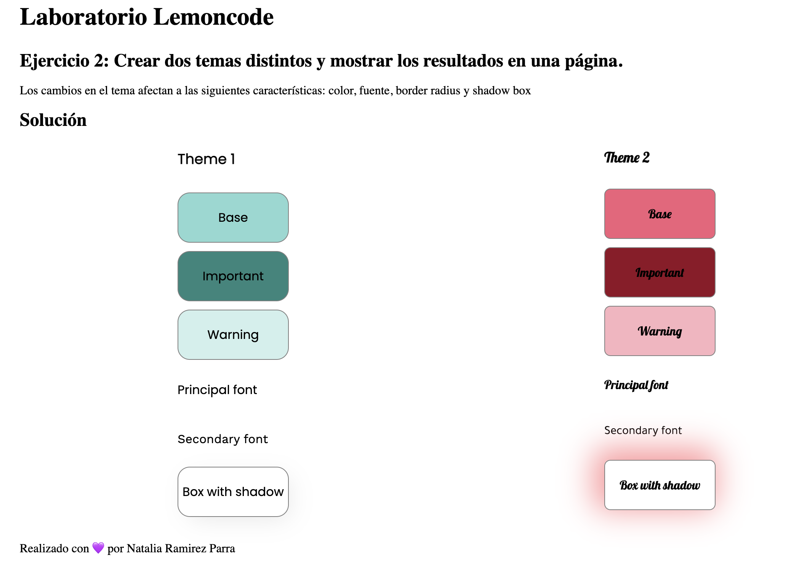
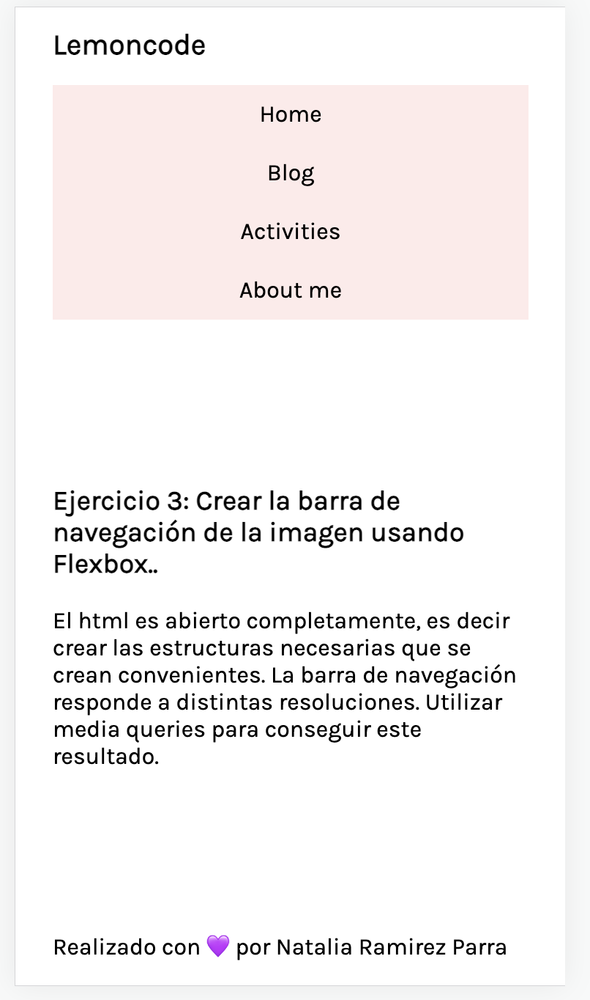
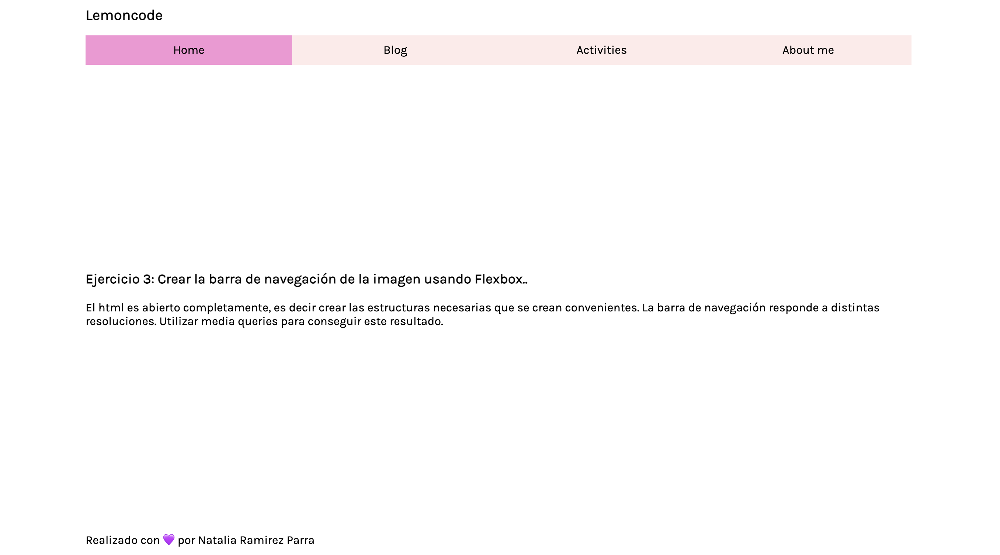

# Desarrollo de actividades del módulo de Maquetación

En este repo se realiza las actividades para aprobar el módulo 1 del Master en Frontend de Lemoncode. 

En está unidad vimos temas como:
- Bases de CSS (Selectores, Cascada, Especifidad, Modelo de Caja)
- Flexbox
- Grid CSS
- Diseño responsivo 
- SASS

## Lenguajes utilizados para el desarrollo de las actividades
- HTML5
- CSS3
- SASS

## Solución ejercicios
### Ejercicio 1

### Ejercicio 2

### Ejercicio 3

### Ejercicio 4

